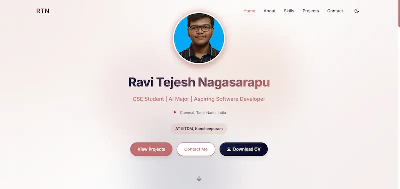

# Ravi Tejesh Nagasarapu | Personal Portfolio



<div align="center">

[](https://ravitejeshnagasarapu.github.io/Portfolio/)
[](https://ravitejeshnagasarapu.github.io/Portfolio/)
[](https://ravitejeshnagasarapu.github.io/Portfolio/)

**[View Live Website](https://ravitejeshnagasarapu.github.io/Portfolio/)**

</div>

## About
A high-performance, responsive personal portfolio website designed to showcase my projects in **Artificial Intelligence**, **Web Development**, and **Core Engineering**. Built with a "Performance-First" architecture using vanilla HTML, CSS, and JavaScript, achieving near-perfect Google Lighthouse scores.

## Key Features
* **Modern UI/UX:** Glassmorphism design, parallax background effects, and smooth scroll animations.
* **Dark/Light Mode:** System-preference aware theme toggling with local storage persistence.
* **Fully Responsive:** Optimized layout for Mobile, Tablet, and Desktop devices.
* **Project Filtering:** Dynamic filtering for AI/ML, Web Dev, and Tools categories.
* **Contact Integration:** Functional contact form powered by **EmailJS**.
* **Performance Optimized:** Engineered for speed (See Technical Optimizations below).

## Tech Stack
* **Frontend:** HTML5, CSS3 (Variables, Flexbox/Grid), JavaScript (ES6+).
* **Libraries:** FontAwesome, DevIcons.
* **Backend Services:** EmailJS (Serverless form handling).
* **Hosting:** GitHub Pages.

## Technical Optimizations (Engineering)
This portfolio was engineered to achieve a **97/100 Lighthouse Performance score** on Desktop and **92+ on Mobile**. Key techniques used:

1.  **Critical Rendering Path:**
    * Used `fetchpriority="high"` and `<link rel="preload">` for the LCP (Largest Contentful Paint) image.
    * Deferred non-critical CSS (Icons) using the `media="print"` loading strategy.
    * deferred all JavaScript execution to unblock the main thread.

2.  **Asset Optimization:**
    * Converted all assets to **WebP format** for superior compression.
    * Implemented responsive image sizing and aspect-ratio reservation to prevent **CLS (Cumulative Layout Shift)**.

3.  **Advanced CSS:**
    * Utilized `content-visibility: auto` to skip rendering off-screen content (reducing Total Blocking Time).
    * Implemented `font-display: swap` to prevent invisible text during load.
    * Minified CSS and JS resources.

4.  **Accessibility (a11y):**
    * Semantic HTML5 structure (`<nav>`, `<main>`, `<section>`).
    * Correct heading hierarchy (`h1` -> `h2` -> `h3`) for screen readers.
    * WCAG AA compliant color contrast ratios.

## Project Structure
  ```bash
  Portfolio/
  ├── contents/
  │   ├── Certifications/   # PDF Proofs
  │   ├── Images/           # Optimized WebP Assets
  │   └── Nagasarapu_Ravi_Tejesh_Resume.pdf
  ├── index.html            # Semantic Markup
  ├── style.css             # Minified Styles
  ├── script.js             # Minified Logic (Deferred)
  └── README.md             # Documentation
  ```
## Featured Projects
The portfolio highlights several key engineering projects:
1. **Automated Bone Age Assessment:** ResNet-18 Deep Learning pipeline (11.33 MAE) on RSNA dataset.
2. **ConnectSphere:** Python-based GUI for LAN Video Conferencing (Sockets/UDP).
3. **Farmers Market:** Full-stack web platform for agricultural commerce.

## Run Locally
This project is static and requires no build steps.

1. **Clone the repository:**
   ```bash
   git clone [https://github.com/Ravitejeshnagasarapu/Portfolio.git](https://github.com/Ravitejeshnagasarapu/Portfolio.git)
   ```
2. **Navigate to the directory:**
   ```bash
   cd Portfolio
   ```
3. **Launch:**
Open `index.html` in your browser or use the Live Server extension in VS Code.

## Contact
* **Email:** [ravitejeshnagasarapu@gmail.com](https://mail.google.com/mail/?view=cm&fs=1&to=ravitejeshnagasarapu@gmail.com)
* **LinkedIn:** [ravitejeshnagasarapu](https://www.linkedin.com/in/ravitejeshnagasarapu/)
* **GitHub:** [Ravitejeshnagasarapu](https://github.com/Ravitejeshnagasarapu)

---
*© 2025 Ravi Tejesh Nagasarapu. All Rights Reserved.*
